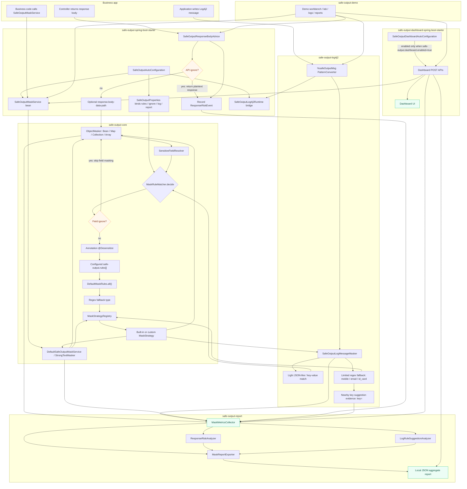

# Safe Output 架构决策与安全边界说明

## 1. 文档定位

本文用于说明 Safe Output 当前架构为什么这样设计，而不是重复罗列全部功能。项目总述见 `ai-contest-deliverables/00-submission-overview.md`，需求演进见 `ai-contest-deliverables/02-requirement-evolution.md`。

Safe Output 的核心定位是 Java 8 / Spring Boot 2.x 输出侧脱敏 starter，面向内部 JUP 统一 Java 8 平台这类存量系统。它优先解决 response、Log4j2 日志和业务主动调用中的敏感输出治理问题，同时通过聚合报告和可选 Dashboard 帮助研发团队复盘治理效果。

这套架构有几个稳定前提：

- 业务系统接入成本要低，优先通过 starter、自动装配和少量配置完成接入。
- 脱敏异常不能影响业务主链路，Response、对象递归、日志和报告都坚持 fail-open。
- 统计、报告和 Dashboard 不能变成新的敏感数据存储点，只保存聚合信息或脱敏后的 evidence。
- 日志治理只做轻量 JSON-like / key-value 识别和有限 regex fallback，不引入完整 JSON Parser。
- 治理建议必须由人工确认，不自动修改配置，不自动启用规则。

## 2. 模块边界

Safe Output 采用 Maven 多模块结构，把核心脱敏能力、接入适配、日志适配、报告治理和 Demo 展示拆开。这个拆分让业务系统只依赖 starter，同时避免 Demo 和 Dashboard 的展示逻辑污染核心链路。

| 模块 | 架构职责 | 关键边界 |
|---|---|---|
| `safe-output-core` | 类型标签、默认规则库、规则匹配、字段注解、策略注册、对象递归和主动脱敏基础能力 | 不依赖 Spring；不负责 Web 拦截、日志框架或报告文件 |
| `safe-output-spring-boot-starter` | 对外接入入口，负责 Spring Boot 2.x 自动装配、配置绑定、ResponseBodyAdvice、ignore 和 report/log runtime bridge | 业务系统推荐只直接依赖该 starter；仍使用 `spring.factories`，未迁移 Boot 3 专属入口 |
| `safe-output-log4j2` | 提供 `%safeOutputMsg` / `%safeOutputMessage`，处理日志 key-value、JSON-like 和有限 regex fallback | 不强依赖 JSON Parser；无 Spring 时可用默认规则，接入 starter 后复用 Spring 配置 |
| `safe-output-report` | 采集聚合指标，生成 Response 风险画像、性能画像、Log 规则建议和本地 JSON 快照 | 不保存原始 response、完整日志或敏感值；没有数据库持久化 |
| `safe-output-dashboard-spring-boot-starter` | 可选治理 Dashboard，展示当前进程聚合、历史报告、接口风险、日志建议和通用脱敏实验室 | 默认关闭；不提供登录、权限、审计、数据库、多租户或公网防护 |
| `safe-output-demo` | 端到端样板应用，演示业务工作台、脱敏实验室、日志场景、报告中心和 Dashboard 入口 | 只是验证与展示样板，不是生产接入依赖 |

这个边界的核心取舍是：`core` 保持可复用，`starter` 负责低侵入接入，`log4j2` 和 `report` 分别处理输出通道和治理数据，Dashboard 作为附加包显式启用，Demo 只承担评审和接入样例职责。

## 3. 完整调用链图

下面的 Mermaid 图是当前架构的 Markdown 版本，也可以作为后续绘制正式图片的结构来源。



图中的几条关键路径分别对应实际代码边界：

- Response：`SafeOutputResponseBodyAdvice` 在 JSON 序列化前处理返回值，命中 API ignore 时原样返回，但仍记录 ignored 风险事件；未命中时进入 `ObjectMasker`。
- Log4j2：`%safeOutputMsg` 由 Log4j2 converter 创建，接入 starter 后通过 runtime bridge 复用 Spring 规则、策略、日志选项和报告 collector。
- 主动脱敏：业务显式调用 `SafeOutputMaskService`，复用同一套 String 类型标签、策略注册和统计模型，进入 `MANUAL` 场景。
- 报告：Response、Log、Manual 的成功脱敏事件和 Response 风险事件进入 `MaskMetricsCollector`，再由分析器生成画像、建议和本地 JSON 快照。
- Dashboard：可选 starter 只读取聚合指标、报告快照和脱敏 evidence；启用后提供本地治理视图，不改变在线脱敏链路。

## 4. 核心架构决策

### 4.1 用 starter 做低侵入接入

Safe Output 的目标用户是 Java 8 / Spring Boot 2.x 老系统。很多老系统无法大规模重写 Controller、DTO 转换层或日志打印点，所以架构上选择 `safe-output-spring-boot-starter` 作为对外入口。

starter 负责把配置绑定为 core 可理解的规则，把自定义 `MaskStrategy` Bean 注册到策略表，把 `ResponseBodyAdvice` 装配到 Spring MVC，把 `MaskMetricsCollector` 接入 Response、Manual、Log4j2 和报告导出链路。业务系统不需要直接依赖 core、log4j2 或 report 模块。

这也是为什么当前仍使用 Spring Boot 2.x 的 `spring.factories` 自动装配，而没有把 Boot 3 的 `AutoConfiguration.imports` 作为唯一入口：项目的兼容性基线就是 Java 8 / Spring Boot 2.7.18 这类存量环境。

### 4.2 把脱敏类型从枚举收敛为 String 标签

早期脱敏组件常把类型写死为枚举，但业务系统很容易出现自定义类型，例如员工号、会员号、内部客户编号。Safe Output 因此让配置、注解、策略、上下文、统计都贯穿 String 类型标签。

内置类型仍通过 `MaskTypes` 提供常量，例如 `mobile`、`id_card`、`bank_card`、`email`、`password`。业务扩展时只需要提供同名 `MaskStrategy` Bean，并在 `safe-output.rules[].type` 或 `@Desensitize(type = "...")` 中引用。未知 type 当前会 `warn + DEFAULT fallback`，同时进入未知类型聚合统计，避免配置错误静默丢失。

### 4.3 规则优先级固定，ignore 明确高于脱敏

`MaskRuleMatcher.decide` 固定了规则裁决顺序：

```text
API ignore / 字段 ignore
  -> 字段注解
  -> 配置规则
  -> 默认规则
  -> regex fallback
```

这个顺序的含义是：显式豁免先于一切脱敏规则，注解表示业务代码中的明确意图，配置规则用于老系统不改 DTO 的治理，默认规则只覆盖语义明确字段，regex fallback 最后兜底。

字段级 ignore 通过 `safe-output.ignore.keys` 和 `safe-output.ignore.paths` 生效，只跳过对应字段脱敏。接口级 ignore 通过 `safe-output.ignore.apis` 生效，可以让接口返回明文，但必须进入 Response 风险统计，用于在报告中识别高风险豁免。

### 4.4 默认规则库保守，歧义字段不默认脱敏

默认字段规则集中在 `DefaultMaskRules.all()`，覆盖手机号、身份证、银行卡、邮箱、密码等语义明确字段。`name`、`id`、`code`、`no` 这类歧义字段默认不脱敏，避免误伤商品名、订单号、状态码等业务字段。

如果老系统字段名历史混乱，接入方可以通过：

```yaml
safe-output:
  rules:
    default-enabled: false
```

关闭内置默认字段规则。这个开关只移除默认规则，不影响注解、用户配置规则、ignore 或日志 regex fallback。

### 4.5 日志只做轻量识别，不做重解析

日志治理面对的是非结构化或半结构化文本，误伤和性能边界比 Response 更敏感。Safe Output 因此选择 Log4j2 PatternConverter，而不是侵入业务日志调用点；选择 JSON-like/key-value 正则识别，而不是引入完整 JSON Parser。

日志链路先处理带字段名上下文的片段，例如 `"mobile":"13800138000"`、`email=foo@example.com`。如果启用 regex fallback，才对整条消息做有限兜底，目前边界是手机号、邮箱、合法大陆身份证号。银行卡号不做无字段名上下文的日志兜底，普通 18 位编号也通过身份证轻量校验降低误伤。

日志规则建议来自 fallback 命中附近的 key 线索，只保存 `key=<type>` 形态的脱敏 evidence，不保存完整日志或命中值。建议生成的 YAML 候选默认 `enabled:false`，需要人工复核后采纳。

### 4.6 报告只做聚合快照，不做敏感样本库

报告模块的职责是回答“哪些场景发生了脱敏、哪些接口风险更高、哪些日志 key 需要补规则、链路是否有失败或慢脱敏”，而不是保存原始数据用于审计回放。

`MaskMetricsCollector` 只聚合总量、场景、类型、接口维度、ignore、失败、耗时和日志建议线索。`MaskReportExporter` 输出本地 JSON 快照，`ResponseRiskAnalyzer` 和 `LogRuleSuggestionAnalyzer` 基于聚合信息生成画像和建议。

这意味着报告不能还原原始 response、完整日志或敏感值。当前也没有数据库持久化、集中式治理平台或从历史快照恢复内存计数的能力。

### 4.7 Dashboard 抽离为默认关闭的附加包

R2.6 后，通用治理 Dashboard 从 demo 抽离为 `safe-output-dashboard-spring-boot-starter`。这个决策让真实业务系统可以选择性启用本地治理页面，同时避免把 Demo 的 mock 业务数据、小眼睛明文查看和工作台逻辑带进通用组件。

Dashboard 只在 Spring MVC Servlet Web 应用中，且配置 `safe-output.dashboard.enabled=true` 时装配。它的静态资源使用 GET，后端 API 使用 POST，历史报告读取限制在配置报告目录内，上传报告只在请求内解析、不写入磁盘。

Dashboard 不提供登录、权限、审计、多租户、数据库或公网防护。启用它的业务系统需要自行通过内网、网关、Spring Security 或运维平台保护入口。

## 5. 安全与治理边界

Safe Output 是输出侧治理组件，不是完整安全平台。架构上刻意保留以下边界：

| 边界 | 当前设计 |
|---|---|
| Response 异常 | `ResponseBodyAdvice` 捕获运行时异常并返回原 body，保证业务接口可用 |
| 对象递归异常 | 反射或策略异常时当前分支 fail-open；Bean 字段会原地修改，需要接入方注意对象复用副作用 |
| 日志异常 | converter 初始化或 mask 异常时输出原 message，避免影响日志写入 |
| 报告异常 | 导出失败只记录 failure 指标和 warning，不影响在线脱敏 |
| 敏感原文 | 报告、Dashboard、规则建议不保存原始 response、完整日志或敏感值 |
| 日志扫描 | 不做粗暴全局正则；先 key-value / JSON-like，再有限 fallback |
| 路径规则 | `rules[].paths` 与 `ignore.paths` 是 Safe Output 递归路径，不是完整 JSONPath |
| API ignore | 可以明文返回，但必须进入 ignored 风险统计 |
| 规则建议 | 只输出候选配置，默认关闭，不自动写 YAML、不自动启用 |
| Dashboard | 默认关闭，不自带权限、审计、数据库、多租户或公网防护 |
| 平台兼容 | 当前主要验证 Java 8 / Spring Boot 2.x，Spring Boot 3.x 未确认 |

这些边界的共同目标是：优先保护业务可用性和组件自身的数据安全，同时把治理线索暴露给接入方，让团队能持续补规则、收敛 ignore、评估高风险接口。

## 6. 可复查清单

评审或后续维护者可以用下面路径核对本文结论：

- 项目当前状态：`.codex-memory/00-project-current-state.md`
- 模块地图：`.codex-memory/01-module-map.md`
- 核心调用链：`.codex-memory/02-core-flow-map.md`
- 设计边界：`.codex-memory/03-decision-and-boundary.md`
- 组件 README：`safe-output/README.md`
- 组件接入手册：`safe-output/doc/component-integration-guide.md`
- Response 和 core 原理：`safe-output/doc/core.md`
- 项目代码概览：`doc/safe-output-project-overview.md`
- Report 模块说明：`doc/safe-output-report-module-guide.md`

本文没有声明以下能力已经实现：Spring Boot 3.x 兼容、完整 JSON Parser 日志解析、集中式治理平台、数据库持久化、Dashboard 权限审计、多租户、公网防护、规则自动采纳或自动改写配置。
