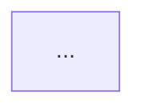

# 架构决策与安全边界说明

> *This was generated by AI during triage.*

- category: enhancement
- state: done
- source: CONTEXT.md, .codex-memory/02-core-flow-map.md, .codex-memory/03-decision-and-boundary.md, safe-output/README.md
- deliverable: ai-contest-deliverables/03-architecture-decisions.md
- blocked_by: 0001-submission-overview.md

## Completion notes

已完成并经人工复核。交付文档 `ai-contest-deliverables/03-architecture-decisions.md` 已说明 Safe Output 的模块边界、Response / Log4j2 / Manual / Report / Dashboard 调用链、核心架构决策、安全边界和未实现能力边界；文档包含可维护 Mermaid 调用链图，并额外生成 `ai-contest-deliverables/architecture.png` 作为参赛材料架构图资产。材料明确保持 fail-open、不保存敏感原文、Dashboard 默认关闭且不提供权限/审计/数据库/公网防护、规则建议人工确认等边界。

## Agent Brief

**Category:** enhancement

**Summary:** Create the architecture decisions deliverable, including a Markdown-maintainable end-to-end masking call-chain diagram.

**Current behavior:**

The contest deliverables currently include the project overview, AI development process, and requirement evolution materials. There is no standalone architecture decisions document yet. The issue body also does not give an agent enough detail to produce a complete architecture narrative or a reusable call-chain diagram.

**Desired behavior:**

Create `ai-contest-deliverables/03-architecture-decisions.md` as a reviewer-facing architecture decisions document. It should explain why Safe Output uses its current module boundaries, output-side interception points, rule matching order, extension model, report model, Dashboard boundary, and safety constraints.

The document must include one Markdown-native architecture/call-chain diagram using Mermaid. This diagram is the source of truth for any later image-generation work: future visual diagrams should redraw this structure, not invent a different architecture.

**Key interfaces and concepts:**

- `safe-output-spring-boot-starter` as the low-intrusion business integration entrypoint.
- `SafeOutputResponseBodyAdvice` as the Response masking interception point.
- `%safeOutputMsg` / `SafeOutputLogMessageMasker` as the Log4j2 masking path.
- `SafeOutputMaskService` as the manual masking entrypoint.
- `ObjectMasker`, `SensitiveFieldResolver`, `MaskRuleMatcher`, `MaskStrategyRegistry`, and `MaskStrategy` as the core masking engine.
- `MaskMetricsCollector`, `ResponseRiskAnalyzer`, `LogRuleSuggestionAnalyzer`, and `MaskReportExporter` as the aggregate report path.
- `safe-output-dashboard-spring-boot-starter` as the optional, disabled-by-default governance Dashboard.
- String type labels, custom `MaskStrategy`, configured `safe-output.rules[]`, default rule switch, field/API ignore, and regex fallback as the main extension and decision points.

**Out of scope:**

- Do not change Java, JavaScript, CSS, Maven, or runtime behavior for this issue.
- Do not add new masking algorithms or new module responsibilities.
- Do not claim support for Spring Boot 3.x, built-in authentication/authorization, audit logging, database persistence, multi-tenant governance, public-network protection, full JSON parser log analysis, or automatic rule adoption.
- Do not describe reports, Dashboard, or suggestions as storing raw response bodies, full log messages, or sensitive values.

## What to build

整理一份架构决策材料，解释 Safe Output 为什么采用当前模块边界、调用链和安全策略。重点突出低侵入 starter、Java 8 / Spring Boot 2.x 基线、fail-open、聚合报告不保存敏感原文、日志轻量识别、String 类型标签、自定义策略、可选 Dashboard starter 等决策。

正文建议结构：

- 项目架构总览：面向老系统的输出侧脱敏 starter，而不是完整安全平台。
- 模块边界：core、starter、log4j2、report、dashboard starter、demo。
- 完整链路图：用 Mermaid 画出 Response、Log4j2、主动脱敏、报告、Dashboard 的模块流程。
- 核心架构决策：低侵入接入、统一类型标签、规则优先级、扩展点、默认规则开关、Dashboard 抽离。
- 安全与治理边界：fail-open、ignore 风险统计、不保存敏感原文、轻量日志识别、规则建议人工确认。

## Diagram requirements

`03-architecture-decisions.md` must include a Mermaid diagram in a fenced code block:

````

````

The diagram must be maintainable in Markdown and suitable as a source for later image-generation work. It should cover these nodes and flows:

- Input paths:
  - Controller returns Response body.
  - Application writes Log4j2 message.
  - Business code calls `SafeOutputMaskService`.
- Integration layer:
  - `SafeOutputResponseBodyAdvice`
  - `%safeOutputMsg`
  - `SafeOutputMaskService`
- Core engine:
  - `ObjectMasker`
  - `SensitiveFieldResolver`
  - `MaskRuleMatcher`
  - `MaskStrategyRegistry`
  - built-in/custom `MaskStrategy`
- Rule decisions:
  - API ignore: return plaintext response, but record ignored risk.
  - field ignore: skip field masking.
  - annotation rule.
  - configured `safe-output.rules[]`.
  - default rules, optionally disabled by `safe-output.rules.default-enabled=false`.
  - regex fallback, limited to supported fallback types and used last.
- Outputs:
  - masked response.
  - masked log message.
  - manual masking result.
- Observability and governance:
  - `MaskMetricsCollector`
  - `ResponseRiskAnalyzer`
  - `LogRuleSuggestionAnalyzer`
  - `MaskReportExporter`
  - local JSON aggregate report.
  - optional Dashboard starter.
- Safety boundaries:
  - fail-open on Response/Object/Log/Report errors.
  - report and Dashboard keep aggregate metrics or masked evidence only.
  - no raw response, full log, or sensitive value storage.
  - Dashboard is optional and disabled by default.

Use Mermaid subgraphs to make module boundaries visible. Recommended subgraphs:

- `Business app`
- `spring-boot-starter`
- `core`
- `log4j2`
- `report`
- `dashboard starter`
- `demo`

The `demo` subgraph should be shown only as a verification/sample app, not as a production dependency.

## Input materials

- `CONTEXT.md`
- `.codex-memory/00-project-current-state.md`
- `.codex-memory/01-module-map.md`
- `.codex-memory/02-core-flow-map.md`
- `.codex-memory/03-decision-and-boundary.md`
- `.codex-memory/04-next-round-handoff.md`
- `safe-output/README.md`
- `safe-output/doc/component-integration-guide.md`
- `safe-output/doc/core.md`
- `doc/safe-output-project-overview.md`
- `doc/safe-output-report-module-guide.md`
- `ai-contest-deliverables/00-submission-overview.md`
- `ai-contest-deliverables/01-ai-development-process.md`
- `ai-contest-deliverables/02-requirement-evolution.md`

Suggested source-code anchors for fact checking:

- `SafeOutputResponseBodyAdvice`
- `SafeOutputAutoConfiguration`
- `MaskRuleMatcher`
- `ObjectMasker`
- `SafeOutputLogMessageMasker`
- `SafeOutputLog4j2Runtime`
- `MaskMetricsCollector`
- `MaskReportExporter`
- `SafeOutputDashboardAutoConfiguration`
- `SafeOutputDashboardController`

## Acceptance criteria

- [x] 新建 `ai-contest-deliverables/03-architecture-decisions.md`。
- [x] 解释核心模块职责：core、starter、log4j2、report、dashboard starter、demo。
- [x] 解释关键调用链：Response、Log4j2、主动脱敏、报告生成、Dashboard。
- [x] 包含一张 Mermaid 调用链图，覆盖完整脱敏链路、模块流程、扩展边界和 ignore 分支。
- [x] 图中体现 Response、Log4j2、Manual 三类输入如何进入统一 core 规则/策略链路。
- [x] 图中体现统计、风险画像、Log 规则建议、报告导出和 Dashboard 如何只消费聚合信息或脱敏 evidence。
- [x] 图中体现 demo 只是验证样板，不是 starter 的生产依赖。
- [x] 明确安全边界：fail-open、不保存敏感原文、不保存完整 response 或完整日志、不做粗暴全局正则、不引入 fastjson。
- [x] 明确日志边界：只做轻量 JSON-like/key-value 识别，regex fallback 最后执行且仅覆盖当前支持的低误伤类型。
- [x] 明确 ignore 边界：字段级 ignore 跳过字段脱敏；API ignore 可以明文返回，但必须进入 Response 风险统计。
- [x] 明确扩展边界：自定义 `MaskStrategy`、String type、`safe-output.rules[]`、默认规则开关、Dashboard 默认关闭。
- [x] 明确治理边界：Log 规则建议默认 `enabled:false`，由人工确认，不自动改 YAML、不自动启用规则。
- [x] 不把 Dashboard 描述成自带权限、审计、数据库、多租户或公网防护能力。
- [x] 不把 Spring Boot 3.x、集中式治理平台、数据库持久化、自动规则采纳描述为已实现能力。
- [x] 文档叙事与 `00-submission-overview.md`、`01-ai-development-process.md`、`02-requirement-evolution.md` 不冲突，避免大段重复。

## Test requirements

- [x] 人工检查所有边界表述与 `.codex-memory/03-decision-and-boundary.md` 一致。
- [x] 人工检查调用链图与 `.codex-memory/02-core-flow-map.md` 一致。
- [x] 人工检查 `safe-output/README.md` 和 `safe-output/doc/component-integration-guide.md` 中的接入口径没有被改写或夸大。
- [x] 人工检查架构图或调用链文字没有引入不存在的模块、类、配置项或运行时能力。
- [x] 人工检查 Mermaid 代码块可读、模块分组清晰，后续可作为 image 作图参考。
- [x] 不需要运行 Maven 测试；本 issue 的交付物是 Markdown 参赛材料，不修改代码。
